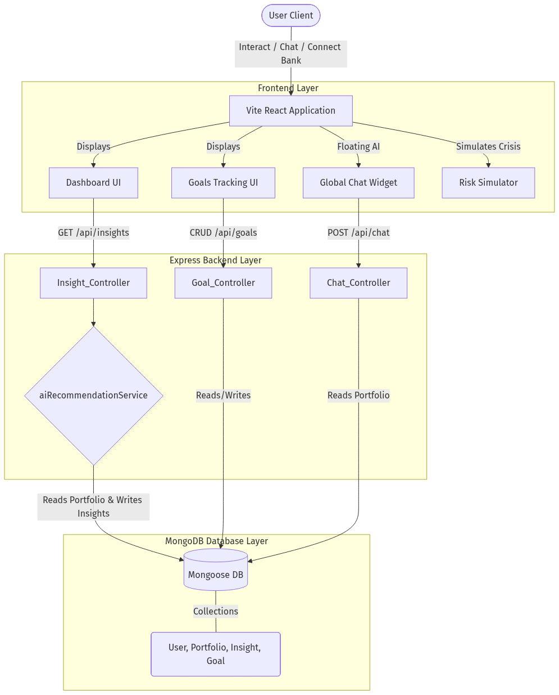

# MentorAI: Full-Stack Personal Finance Automation

MentorAI is a next-generation, full-stack personal finance platform built to provide highly personalized, mathematical edge-based financial intelligence without relying on expensive, generic LLM queries. It evaluates a user's highly specific live portfolio metrics against deep economic models to generate custom insights, risk simulations, and tracking mechanisms.

## 🚀 Key Features

### 1. AI Insights & Personalization Engine
A localized, backend Mongoose rules-engine calculates real-time insights based on the user's `Portfolio`. 
* **Explainability Layer**: Insights instantly render on the dashboard via an expandable accordion, revealing exactly *why* a mathematical threshold (like an Emergency Fund or Tax Bracket limit) was triggered.

### 2. Conversational NLP AI Assistant
A global, floating Chat Interface parsing user semantic intent.
* By mapping queries (like "tax" or "overlap") directly to the active MongoDB portfolio state, the system responds with deterministic, hyper-personalized advice tailored strictly to the user's logged metrics.

### 3. Deep Financial Edge Systems
* **Risk Simulation Engine**: Models Portfolio destruction during exact % Market Drops paired with localized Indian CPI Inflation. Factors in fixed-income EPF and PPF hedges to prevent premature equity liquidations.
* **Goal Tracking**: Full CRUD database implementation allowing users to map SIP velocities against long-term house deposits or retirement nest eggs.
* **Smart Notifications**: Global notification toast engine instantly alerting users to missed mandates or critical timeline events.

### 4. Core Calculators
* FIRE (Financial Independence, Retire Early) Timeline Planner
* Couples Goal Compatibility Planner
* Mutual Fund Portfolio X-Ray
* Term Insurance Predictor & Tax Wizard

## 💻 Tech Stack
* **Frontend**: React (Vite), TypeScript, Lucide Icons, Custom CSS Modules
* **Backend**: Node.js, Express.js, JWT Authentication
* **Database**: MongoDB (Mongoose Schema Architecture)

## 🛠 Setup & Launch Instructions

### 1. Clone the Repository
\`\`\`bash
git clone https://github.com/Abhilanshu/ET-Hackathon.git
cd ET-Hackathon
\`\`\`

### 2. Backend Initialization
\`\`\`bash
cd server
npm install
\`\`\`
*(Note: A local MongoDB instance must be running, or provide a `MONGO_URI` in an `.env` file).*
\`\`\`bash
npm run dev
\`\`\`

### 3. Frontend Initialization
In a new terminal window, navigate to the root directory:
\`\`\`bash
npm install
npm run dev
\`\`\`
The Vite proxy will seamlessly route all `/api/...` traffic to the Express backend running on Port 5000.

## 📄 Architecture & Business Impact Models
Please review the complete documentation nested in the `/docs` folder:
* [Architecture Diagram & Component Documentation](docs/architecture.md)
* [Business Impact & Revenue Model](docs/impact_model.md)
