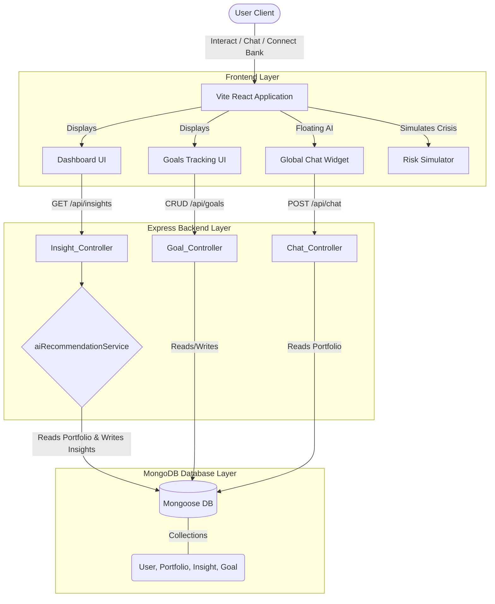

# Full-Stack Architecture Document (MentorAI)

The application has been successfully transformed from a static frontend prototype into a robust, full-stack application. It leverages a modern MERN-like stack (React, Node.js, Express, MongoDB) integrated with rule-based AI engines for mathematical personalization.

## 1. High-Level Architecture Diagram

## 2. Core Components & Responsibilities

1. **Vite React Frontend (`/src`)**: 
   - Responsible for rendering interactive UI pages (`Dashboard`, `Goals`, `RiskSimulator`).
   - Maintains global state and secure JWT tokens via `AuthContext.tsx`.
   - Uses `lucide-react` for iconography and custom CSS for animations.

2. **Express Backend API (`/server`)**: 
   - Acts as the secure gateway. Handles all API requests routed via the Vite proxy (`/api/...`).
   - Protected endpoints are secured by `authMiddleware.js`, verifying JWT signatures before granting access to controllers.

3. **MongoDB Data Layer (`/server/models`)**: 
   - Contains strictly typed Mongoose schemas:
     - `User`: Standard authentication.
     - `Portfolio`: Stores live connected net-worth and active SIP velocity.
     - `Insight`: Stores generated AI recommendations, their reasons (Explainability), and dismissal status.
     - `Goal`: Tracks multi-milestone financial targets (CRUD).

## 3. AI Engines & Intelligence Flow

1. **AI Personalization & Insights Engine**:
   - The `aiRecommendationService.js` evaluates the user's live `Portfolio` against algorithmic financial models.
   - Example Flow: User logic breaches a threshold (e.g., Liquid Cash < 12 months) -> Backend creates a `warning` Insight -> Frontend Dashboard dynamically renders the Warning Insight Card.
   - **Explainability**: Every generated insight automatically attaches a mathematically justified `reason` string, rendered on the frontend via an expandable accordion.

2. **Conversational Chat Interface (`/api/chat`)**:
   - A floating global React widget (`ChatWidget.tsx`) securely queries the Chat Controller.
   - The backend NLP logic dynamically parses keyword intents (e.g., "tax", "overlap", "emergency") and injects the user's real-time MongoDB portfolio size directly into the response text, avoiding generic, unhelpful advice.

## 4. Edge Systems
* **Risk Simulation Engine**: A localized client-side engine (`RiskSimulator.tsx`) that projects portfolio destruction based on configurable Market Drop (%) and Indian CPI Inflation (%) parameters. It specifically calculates purchasing power decay over 5 years and provides logical hedging strategies (EPF/PPF).
* **Smart Notifications**: A global `SmartNudge.tsx` toast component that mounts over the DOM to immediately alert users of critical asynchronous events (e.g., missed SIP mandate alerts).
